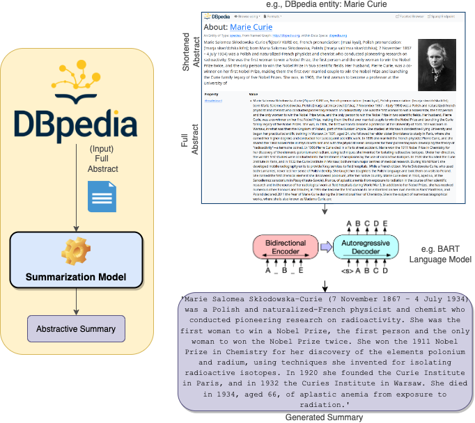

## Towards Abstractive Summarization of DBpedia Abstracts Using Language Models


This repository contains code for our paper "Abstractive Summarization of DBpedia Abstracts Using Language Models." We propose an approach using pre-trained language models, specifically BART and T5, to generate short and comprehensive summaries for DBpedia abstracts in six languages (English, German, French, Italian, Spanish, and Dutch).

<p align="center">

</p>
<p align="center">The pipeline of DBpedia summarization using language models</p>


## Dependencies

- bert-score 0.3.12
- ipykernel 6.17.1
- ipython 8.6.0
- nltk 3.7
- notebook 6.5.2
- pandas 1.5.1
- spacy 3.4.3
- torch 1.13.0
- transformers 4.25.1


## Repository Structure:

```
├── data
│   ├── info.md
├── data_crowd
│   ├── de_crowd.csv
│   ├── en_crowd.csv
│   ├── es_crowd.csv
│   ├── fr_crowd.csv
│   ├── it_crowd.csv
│   ├── nl_crowd.csv
├── data_eval
│   ├── de_100_summaries.csv
│   ├── en_100_summaries.csv
│   ├── es_100_summaries.csv
│   ├── fr_100_summaries.csv
│   ├── it_100_summaries.csv
│   ├── nl_100_summaries.csv
├── full_abstracts
│   └── info.md
├── short_abstracts
│   └── info.md
├── baselines.ipynb
├── data_creation.ipynb
├── dbepdia-summarization.png
├── DBpepdia-abstractive-summarization.md
├── LICENSE
├── README.md
├── requirements.txt
├── summarization-cuda1.py
└── summarization-split.py
```

## Installation

To install the dependencies, run:

```
pip install -r requirements.txt
```

## Data Preparation

1. Download the DBpedia abstract file (in .ttl format) for the desired language from [this source](http://downloads.dbpedia.org/2015-04/ext/nlp/abstracts/) and place it in the `full_abstracts` folder.
2. Download the DBpedia short abstract file (in .ttl format) for the desired language from [this source](https://databus.dbpedia.org/dbpedia/text/short-abstracts/) and unzip it in the `short_abstracts` folder.
3. Run the `data_creation` notebook. The final dataframes should be located in the `data` folder.


## Crowdsourcing evaluation

The complete result of evaluation made by crowdsourcing agents are presented in [data_crowd](/data_crowd/) folder. The data were divided by language. Each file contains column 'choice' which demonstrates which summary were chosen by crowdworker.


## Pretrained Models

1. The data for generating summaries is located in the `data` folder in .csv files.
2. The `baselines.ipynb` notebook contains the code for running the pretrained models (T5, BART, and BART-CNN).
3. The original and short abstracts and generated summaries used for crowdsourcing evaluation are stored in in `data_eval` folder.


## Generating Astractive Summaries for The Full DBpedia Abstracts

More details are descripted [here](DBpedia-abstractive-summarization.md) about downloading and processing the entire DBpedia abstracts.


### Download Genereated Summaries: 
* English version is available at https://zenodo.org/record/7441120
* German (In Progress)

---

## How to cite
```

@article{dbpedia-summarization,
  title={Towards Abstractive Summarization of DBpedia Abstracts Using Language Models},
  author={Hamada M. Zahera, Fedor Vitiugin, Mohamed Ahmed Sherif, Carlos Castillo and Axel-Cyrille Ngonga Ngomo},
  Conference={TBD},
  year={TBD},
  publisher={TBD}
}

```

## Contact

For any questions or feedback, please contact the corresponding authors at [fedor.vitiugin@upf.edu](mailto:fedor.vitiugin@upf.edu) and [hamada.zahera@uni-paderborn.de](mailto:hamada.zahera@uni-paderborn.de).

